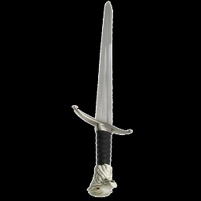
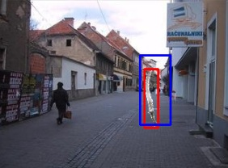

# Model detecting swords on images

## 📖 Introduction
The purpose of this project is to present the methodology used in designing and training an artificial neural network using Python and the PyTorch library. The task of the network is to enclose a sword found in an image with a bounding box. For the network to work correctly, it should accurately identify swords, ensuring that the extreme points of the sword define the opposite vertices of the rectangle. This task is challenging due to the presence of multiple types of swords with varying orientations and sizes.

## 📊 Data Generation
To properly train the neural network, suitable data is required. Since an appropriate dataset was not available, it had to be generated. The OpenCV library was used for image processing.

Eight different types of swords were found online. Their backgrounds were removed, and they were rotated so that the blades pointed upwards.

|  |  |
|-------------------------------|-------------------------------|

A collection of background images was also obtained from Kaggle ([link](https://www.kaggle.com/datasets/balraj98/stanford-background-dataset)). A total of 72 backgrounds of similar size and horizontal orientation were selected. For data generation, a sword type, image location, rotation angle, and scale were randomly chosen.

The correct bounding box for each sword was stored in a separate text file, containing four coordinates (xmin, ymin, xmax, ymax), representing the top-left and bottom-right corners of the rectangle.

Since each background was used 50 times, a total of 3600 images were generated. The dataset was then split into training, validation, and test sets using the `train_test_split()` function from the `sklearn` module. The data was divided as follows:
- 70% for training
- 15% for validation
- 15% for testing

## 🔄 Data Transformation
To standardize the input images for the network, all images were resized to 256x256 pixels. These were the only modifications applied to the data for model processing.

## 🧠 Model Architecture
The model is based on convolutional neural networks (CNNs) and utilizes the ResNet architecture. A key feature of this architecture is the use of residual connections. The final component of the network is an output block consisting of three fully connected layers, responsible for predicting the bounding box coordinates.

## ⚙️ Hyperparameters
The model was trained using the following hyperparameter values:

| Parameter           | Value  |
|--------------------|--------|
| Batch size        | 16     |
| Learning rate     | 0.00025 |
| Number of epochs  | 100    |
| Weight decay      | 0.0001 |

Initial parameter values were based on existing solutions, with some fine-tuned experimentally. For example, the number of epochs was set to 100 to ensure proper training—fewer epochs led to frequent errors, while more caused overfitting. The learning rate was adjusted to maintain stable training. The weight decay and batch size were not fine-tuned.

## 📈 Results Achieved
The network's output was evaluated for quality using the IoU (Intersection over Union) metric. This metric calculates the ratio of the intersection area between the predicted and actual bounding boxes to their union, providing an accuracy measure.

The average IoU values for each dataset were as follows:

| Dataset     | Mean IoU |
|------------|---------|
| Training   | 82%     |
| Validation | 71%     |
| Test       | 71%     |

|  |  |
|------------------------------|-----------------------------|

The results show that the model performs significantly better than random guessing. Sample images with predicted bounding boxes illustrate the effectiveness of the trained model. On the images above there are some results of detection. Red boxes represent ground truth annotations, while blue boxes show the model's predictions.

## 🧑‍💻 Author

**Szymon Kryzel**

 